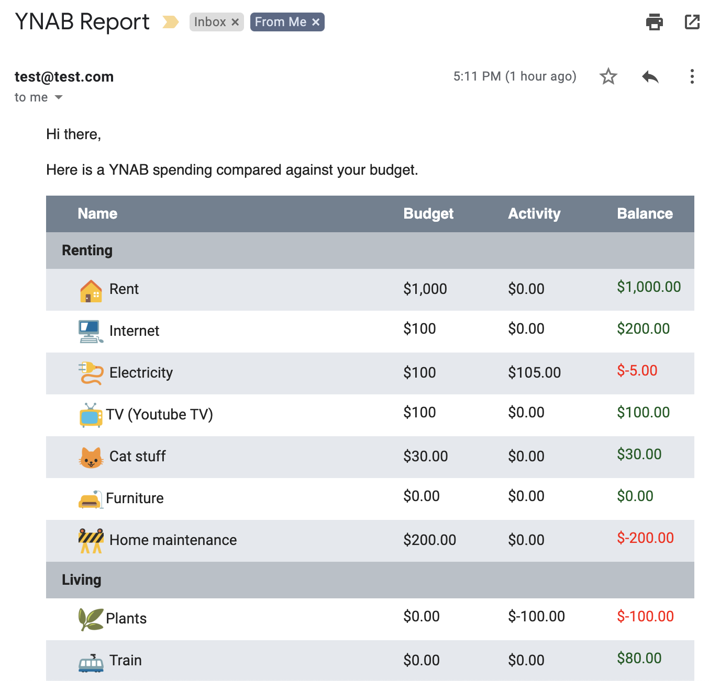

# YNAB-Email

This is a Google App Script that allows you to generate an email based on your YNAB (youneedabudget.com) activity.

The end result will generate an email (as frequently as you'd like) that will look like:

<kbd></kbd>

## Setup

In order to set this up you will need to:

* Have a YNAB account
* Generate a YNAB accessToken ([More info](https://api.youneedabudget.com/#personal-access-tokens))
* Find your budgetID ([More info](#budgetID))

## Creating the Script

Once you have your YNAB variables you need to:

1. Go to [script.google.com](http://script.google.com/)
2. Sign in and create a new script.
3. Paste in the copied code from [ynab-report-appscript.gs](src/ynab-report-appscript.gs)
4. Paste in the copied code from [email.html](src/email.html)
5. In ynab-report-appscript.gs replace the following values with what you want:
    1. accessToken
    2. budgetID
    3. recipientsTO
6. Run the script
6. If you want to automate so it sends an email every week (or whenever) you can do so by
    1. Visiting [script.google.com](http://script.google.com/)
    2. Selecting "My Triggers"
    3. Adding a trigger (bottom righthand button)
    4. Select your settings (make sure to set "time based" for the event source)
    5. Here is my appscript settings:
  

### BudgetID
The BudgetID is the unique code of your YNAB budget which is in the URL when you go to your YNAB budget. Here's a sample screenshot:

### Feedback
Feel free to fork or file issues as you'd like!

## License

The content of this project itself is licensed under the [Creative Commons Attribution 3.0 Unported license](https://creativecommons.org/licenses/by/3.0/), and the underlying source code used to format and display that content is licensed under the [MIT license](LICENSE.md).
